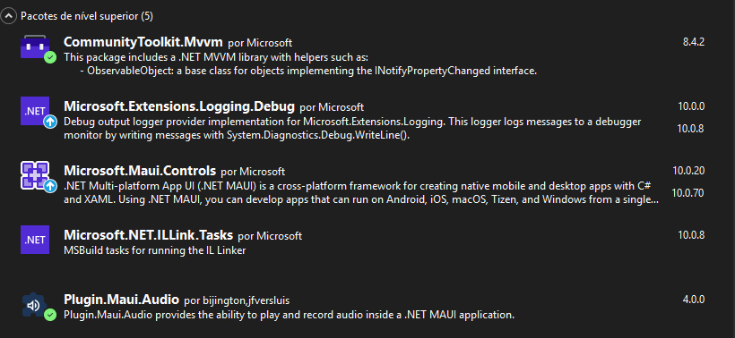
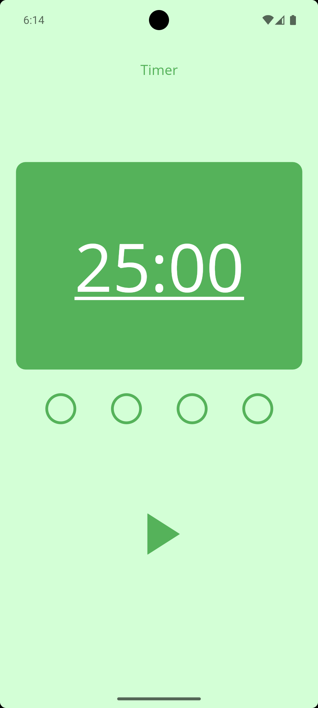

# Demo-Pomodoro

Bem-vindo ao Projeto Demo-Pomodoro

Neste arquivo README, você encontrará informações úteis sobre o funcionamento do projeto.

## Índice

- [Sobre](#sobre)
- [Pré-requisitos](#pré-requisitos)
- [Tecnologias e Frameworks](#tecnologias-e-frameworks)
- [Em funcionamento](#em-funcionamento)
- [Conclusão](#conclusão)

## Sobre

Este projeto é uma demonstração (DEMO) para a aplicação original Minimalist Pomodoro que esta publicada na google play store, contendo a interface principal e uma versão resumida da arquitetura do projeto.

## Pré-requisitos

- [Visual Studio 2022+](https://visualstudio.microsoft.com/) com workload .NET MAUI instalada
- .NET 10 SDK
- Android SDK (para deploy em dispositivo físico ou emulador Android)

## Tecnologias e Frameworks 

Neste projeto, foram utilizadas as seguintes tecnologias e arquitetura:

- C# 
- .NET 10
- .NET MAUI
- MVVM ( Model - View - ViewModel )
- DI ( Dependency Injection )

## Em funcionamento

1. Clone este repositório: `git clone https://github.com/M-LaScala/Demo-Pomodoro`
2. Navegue até o diretório do projeto e abra o arquivo .SLN com o visual studio 2022+
3. Instale os pacotes NuGet dependentes

Plugin.Maui.Audio é utilizado para a reprodução de arquivos de midia dentro do .NET MAUI de forma multiplataforma, ou seja, sem a necessidade de criar implementações específicas para cada plataforma, o que facilita o desenvolvimento e a manutenção do código.

CommunityToolkit.Mvvm é utilizado para a implementação do padrão MVVM, utilizando os recursos de source generators para reduzir o código boilerplate e facilitar a criação de ViewModels reativos e comandos.

O padrão MVVM: 

MVVM é o acrônimo de Model (modelo), View (visão), ViewModel (modelo de visão), e é um padrão de projetos de software utilizado em .NET MAUI.

Model: Modelo e acesso a dados, são essas classes que definirão os padrões dos dados e terão acesso ao "banco de dados".

View: A view corresponde ao Front-end e é onde você coloca as suas telas, como, por exemplo, o HTML em casos de aplicações web, 
janelas em casos de aplicações desktop e, no nosso caso, a sua classe de comunicação com o usuário.

ViewModel: Essa é a parte lógica da aplicação, essa camada é onde se aplicam as regras da aplicação e onde se relacionam os modelos e as views.

Ao executar a aplicação, você verá a interface principal do timer Pomodoro, onde poderá  iniciar o timer e acompanhar os ciclos visuais representados por elipses animadas na tela.

## Conclusão

Este projeto é uma demonstração funcional do timer Pomodoro, implementado com as melhores práticas de desenvolvimento em .NET MAUI e seguindo o padrão MVVM. Ele serve como um exemplo técnico para consulta e pode ser facilmente expandido para incluir funcionalidades adicionais, como personalização de temas, integração com notificações, ou suporte a múltiplos perfis de usuário.